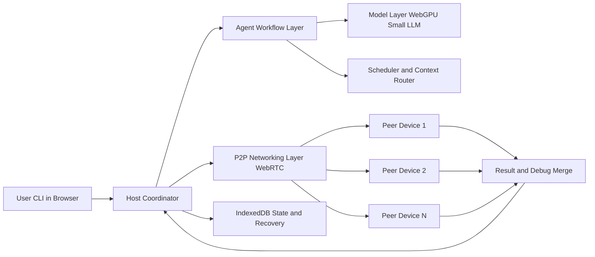

# SouthStack P2P Architecture Diagram

## Protocol and Reliability

- Structured messages: task assign, ack, result, heartbeat, reassignment
- Retry and timeout handling for dropped packets
- Idempotency using message IDs and duplicate suppression
- Auto-reconnect flow with backoff when link is lost

## Security and Privacy

- Session auth token is attached to invite and handshake
- Leader-only authorization for state and task control messages
- Transport uses browser WebRTC secure channels
- Local-only validation report: `LOCAL_DATA_HANDLING_RESULTS.json`
